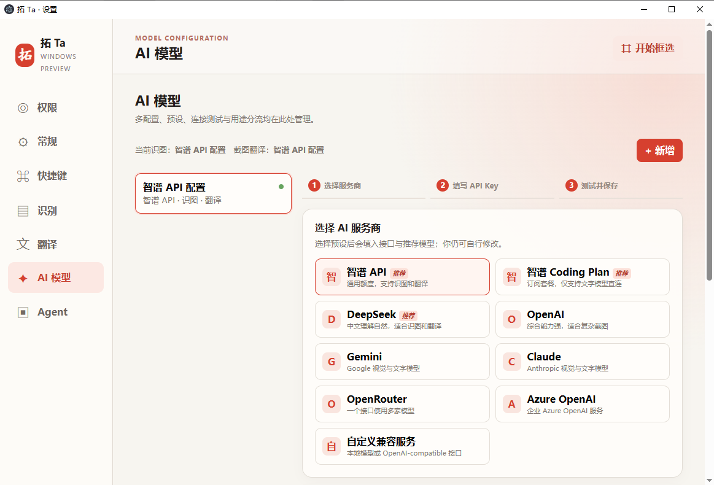
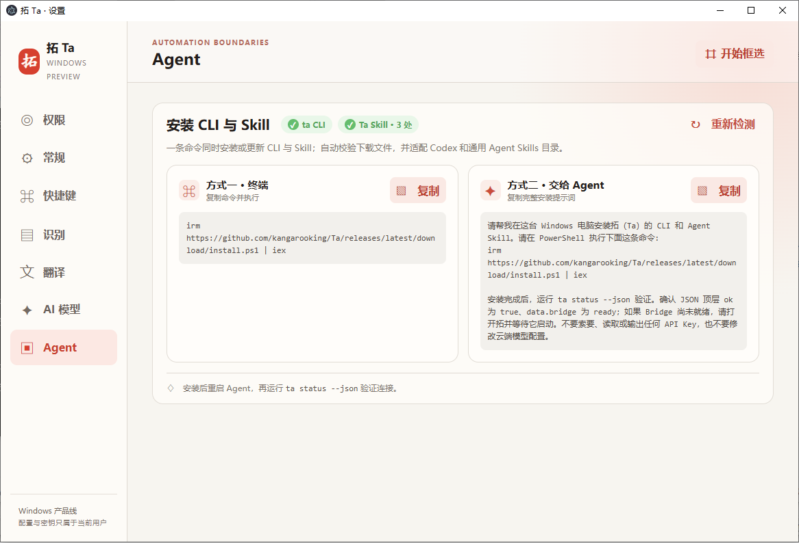
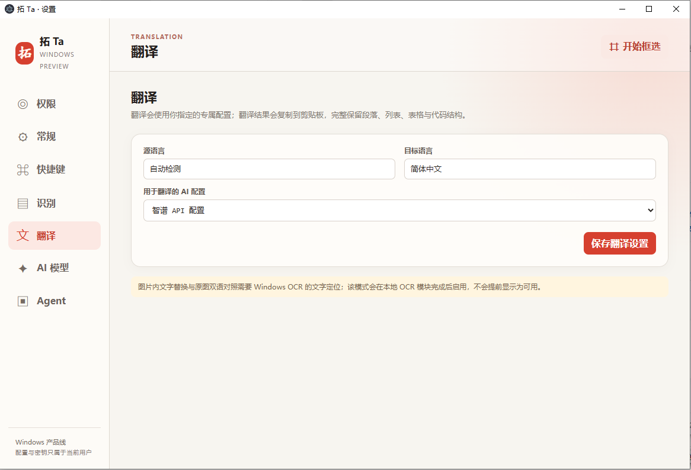
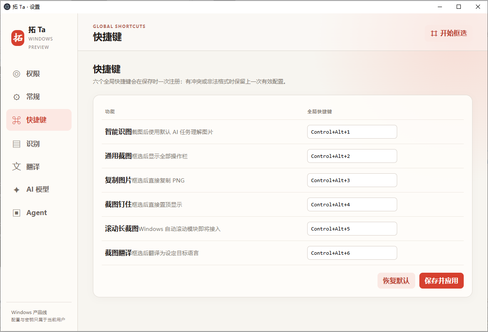
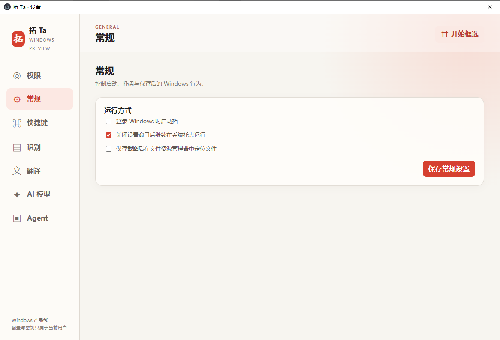

# Ta for Windows（预览版）

这是对 macOS AppKit 客户端的 Windows 桌面实现，采用 Electron，以免影响原有 Swift/macOS 发布链路。

## 已实现

- 完整设置中心：权限、常规、六个全局快捷键、识别、翻译、AI 模型与 Agent 路线图；
- 六个可编辑全局快捷键与冲突回滚：智能识图、通用截图、复制图片、钉图、长截图预留、截图翻译；
- PNG 截图的复制、另存为、可拖动置顶钉图；
- 画笔、矩形、箭头和文字的基础标注；
- 多套命名 AI 配置、Provider 预设、连接测试，以及可分别指定的“识图配置”和“翻译配置”；
- OpenAI-compatible、Azure OpenAI、Anthropic Messages、Google Gemini 的原生视觉请求；
- API Key 使用 Windows 数据保护服务（DPAPI）加密后保存在当前用户的应用数据目录。
- Windows 本地 OCR：支持简中、繁中、英文、日文与韩文语言包，结果在本机完成；
- named-pipe Agent Bridge：默认启用，并以当前 Windows 用户的 ACL 限制连接；已开放显示器截图及对该截图的本地 OCR；
- 可发布的 Windows `ta` CLI、Agent Skill、一键安装/更新脚本与 SHA-256 校验清单。

## 仍未迁移

原 macOS 客户端中依赖 Apple 框架的能力不能直接编译到 Windows：ScreenCaptureKit 排除自身窗口、Carbon 快捷键录制、Accessibility 自动滚动长截图与 macOS Keychain。

这并不意味着这些功能被删除；它们分别对应 Windows OCR、Windows UI Automation、Credential Manager 和 Windows named pipe 实现。尚未完成的自动滚动长截图、窗口级 Agent 截图与云端 Agent 识图不会显示成可用。

## 构建环境

- Windows 10/11 与 Node.js 22+；
- **Electron 必须使用 40.1.0**。该版本由 `package.json` 和 `package-lock.json` 锁定，未在其他 Electron 版本上验证；请勿替换为 `latest` 后直接发布。
- 使用 `npm ci` 安装锁定依赖，确保本机、CI 与发布包使用同一套 Electron/构建工具版本。

升级 Electron 时，必须同时更新 `package.json`、`package-lock.json` 与 `allowScripts` 条目，并重新运行测试和 Windows 打包验证。

## 从源码运行

```powershell
cd Windows
npm ci
npm start
```

首次启动会打开设置窗口。复制、保存、钉图、标注无需模型配置；要使用取字、识图或翻译，请填写支持 `POST /v1/chat/completions`、且能够接受图片输入的服务地址、模型名与 API Key。

## 打包

```powershell
cd Windows
npm ci
npm run package
```

安装器和便携版会输出到 `Windows/dist/`。

## 一条命令安装或更新 CLI 与 Skill

发布 Windows Release 后，用户可在 PowerShell 中执行：

```powershell
irm https://github.com/kangarooking/Ta/releases/latest/download/install.ps1 | iex
```

安装器会下载 CLI、Skill 和 `SHA256SUMS.txt`，在写入前验证两份压缩包的 SHA-256，然后原子更新：

- CLI：`~\.local\bin\ta.cmd`；首次安装会把该目录写入用户级 `PATH`；
- Codex：`$CODEX_HOME\skills\ta`，未设置 `CODEX_HOME` 时为 `~\.codex\skills\ta`；
- 通用 Agent Skills：`~\.agents\skills\ta`；若已有 Claude 配置目录，也同步更新 `~\.claude\skills\ta`。

从源码验证安装器而不改动真实目录和 PATH：

```powershell
cd Windows
npm run package:agent
powershell -ExecutionPolicy Bypass -File scripts\install.ps1 -SourceDirectory artifacts\release\v0.1.0 -InstallRoot "$env:TEMP\ta-install-test" -SkipPathUpdate -SkipStatusCheck
```

安装完成后，打开 **拓 Ta**（Bridge 默认启用），然后运行：

```powershell
ta status --json
ta capabilities --json
```

Bridge 使用 Windows named-pipe ACL，只接受当前 Windows 用户；无需复制、保存或管理额外令牌。

## 设置中心预览

以下为不含个人路径或凭据的 Windows 界面验收截图：

| AI 模型 | Agent |
| --- | --- |
|  |  |
| 翻译 | 快捷键 |
|  |  |



## 验证

```powershell
cd Windows
npm test
```

运行后依次验证：按快捷键框选，复制到任意聊天输入框；保存 PNG；钉图可拖动且始终置顶；在标注窗口绘制后复制；配置模型后检查取字、识图、翻译的文本是否进入剪贴板。
